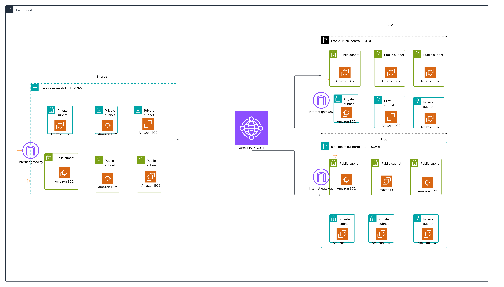
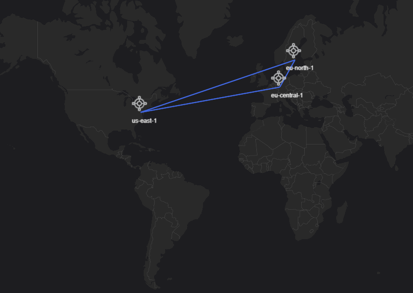
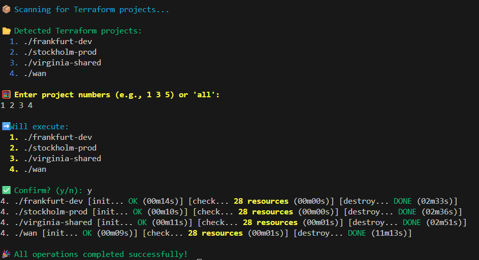
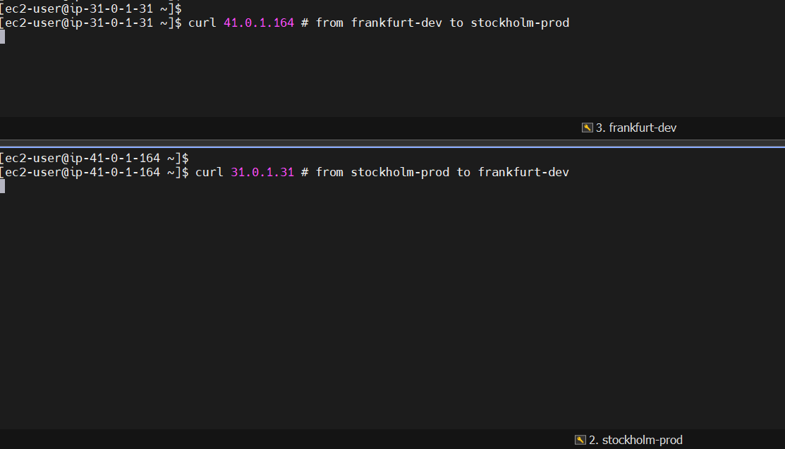
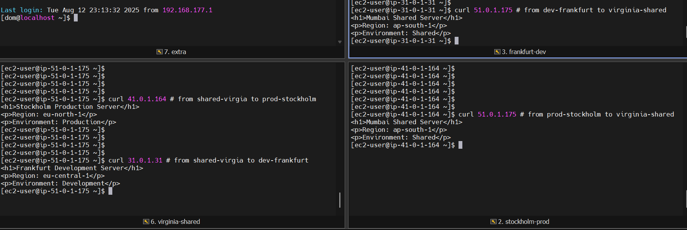

# AWS Cloud WAN (Multi-Region) - Terraform

## Goal

Build a multi-region AWS Cloud WAN network that connects three regional VPCs (Shared, Dev, and Prod) across different AWS regions, enabling secure cross-region communication while demonstrating network segmentation and connectivity patterns using Terraform Infrastructure-as-Code.

This repo is organized as multiple Terraform projects:

- `wan/`: Cloud WAN global/core network (create this first)
- `virginia-shared/`, `frankfurt-dev/`, `stockholm-prod/`: Regional VPCs + attachments that reference WAN remote state
- `deploy.sh`: helper script to apply/destroy selected projects

All diagrams down 


1.Architecture





2.VPC's





3.Terraform execution order





4.Terminal testing -1 

Dev can't ping to prod and vice vera 





5.Terminal testing -2

Both Dev and prod can ping to Shared and vice-versa





## Deployment order

From `read-this-deployment-order`:

- **Apply**: first `wan` then the regional folders
- **Destroy**: first regional folders then `wan`

## Prerequisites

- AWS CLI configured
- Terraform installed

## Option A: Use the helper script

```bash
cd /home/dom/AWS-WAGH-SESSIONS/aws-worked-projects/aws-wan
chmod +x deploy.sh
./deploy.sh
```

## Option B: Manual (apply)

```bash
cd /home/dom/AWS-WAGH-SESSIONS/aws-worked-projects/aws-wan

cd wan && terraform init && terraform apply -auto-approve && cd ..
cd virginia-shared && terraform init && terraform apply -auto-approve && cd ..
cd frankfurt-dev && terraform init && terraform apply -auto-approve && cd ..
cd stockholm-prod && terraform init && terraform apply -auto-approve && cd ..
```

## Verify

- Validate WAN resources and attachments in AWS Console (Network Manager / Cloud WAN)
- Test cross-region reachability using the provided screenshots in the repo

## Cleanup (manual)

```bash
cd /home/dom/AWS-WAGH-SESSIONS/aws-worked-projects/aws-wan

cd stockholm-prod && terraform destroy -auto-approve && cd ..
cd frankfurt-dev && terraform destroy -auto-approve && cd ..
cd virginia-shared && terraform destroy -auto-approve && cd ..
cd wan && terraform destroy -auto-approve && cd ..
```

## Troubleshooting

- **Remote state errors**: regional folders reference WAN state (ensure `wan/terraform.tfstate` exists).
- **No routing between regions**: check core network policy and attachments.
